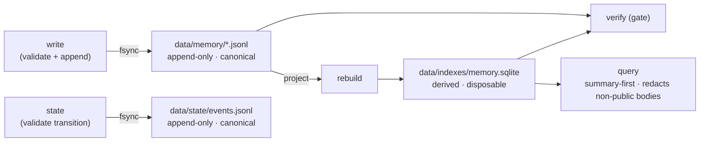

# governed-second-brain

A personal memory layer you extend your own mind with — and that earns the word
*memory*.

We are all told to extend our minds with AI: let it be your second brain. Then
you watch the memory it gives you. It makes things up — recalls a decision you
never made, a doc that never existed, and sounds sure. It is a black box — you
cannot see what it holds, inspect it, or carry it with you. And it does not grow
with you — it has no idea what *you* decided matters, so the one thing you needed
drowns in a week of noise. So you stop trusting it with anything that counts. A
second brain you cannot trust is not a second brain.

This repository is the smallest faithful answer. It is a memory that is yours:

- **It does not make things up.** Every answer comes from something *you* saved,
  and it comes back with its source. No source, no answer — it would rather stay
  silent than invent.
- **It stays yours to inspect.** The truth is an append-only log you own and can
  read with your own eyes; the search index is a derived, disposable copy rebuilt
  from it. Not a black box — you can open it, carry it, and prove it.
- **It grows with you.** It captures what you decided matters, keeps the signal
  above the noise, and helps you survey what is open and plan what is next.

And it makes the assistant you already use trustworthy. Over the Model Context
Protocol, an agent runtime — Copilot, Copilot Studio, Microsoft 365 Copilot, or
any MCP client — grounds on this store, so the AI you talk to every day answers
from a memory that won't lie and that you own. This layer doesn't route around
your assistant; it gives it the trustworthy memory underneath.

It is not a product. It is a *shape* — a governed store where canonical records
are append-only, the search index is derived and disposable, and an executable
verifier decides whether the memory is intact. It is the smallest faithful
answer to the three failures most "AI second brain" setups share: notes pile up
faster than anything can navigate them, a citation rule that lives in a prompt
fails confidently and rarely, and a derived view drifts from its source while
everyone keeps trusting it.

It is dependency-free. A memory layer should not fall over because of a
`pip install`. The only thing it needs is a Python standard library with SQLite
FTS5, which ships by default.

## The idea in one diagram



Five properties make it a memory layer rather than a pile of files:

1. **Durable, structured artifacts** outside the context window — append-only
   JSON Lines you never rewrite.
2. **Summary-first navigation** — the full-text index covers `title`, `summary`,
   and `tags`, *never* `body`, so retrieval cost grows with the number of
   summaries, not the total volume of content.
3. **A hard verification gate** — a build-breaking check that every citation
   resolves and that the derived index matches the canonical log.
4. **A separate state log** — workflow transitions are events in their own
   append-only log, validated against the current status and carrying evidence,
   so status is replayable rather than overwritten.
5. **A visibility floor** — non-public bodies are redacted on read unless
   explicitly revealed, so the private-to-public boundary is enforced by code.

## Quickstart

```bash
# from the repository root
python -m pip install -e ".[dev]"     # or just put src/ on PYTHONPATH

governed-memory seed                  # write 5 example records to data/memory/
governed-memory rebuild               # project the log into the derived index
governed-memory verify                # the gate — prints OK or exits non-zero
governed-memory query "summary first navigation"
```

Add your own:

```bash
governed-memory write --type source \
  --title "Append-only logs as a system of record" \
  --summary "Write events once and never mutate them; derive every read view from the log." \
  --tag architecture --sensitivity public

governed-memory rebuild && governed-memory verify
```

Run the tests:

```bash
pytest -q
```

The interesting test is `test_verify_catches_dangling_citation`: it proves the
gate actually *fails* on a citation that points at a record that does not exist —
the hallucinated-citation failure made mechanical.

## Reaching the store over MCP

The store is also reachable over the Model Context Protocol, so an agent runtime
can query and (deliberately) write to it. The server is the *governed write
surface* — and it is safe to expose because of its gate, not despite the absence
of a server.

```bash
pip install -e ".[mcp]"

# read-only by default — the safe posture
python -m governed_memory.mcp_server

# writes require a deliberate two-flag opt-in
GOVERNED_MEMORY_ENABLE_WRITE=true GOVERNED_MEMORY_REQUIRE_APPROVAL=false \
    python -m governed_memory.mcp_server
```

- **Local stdio only.** No socket, no HTTP, no record leaves the machine.
- **Writes default-off.** `memory.append`, `memory.rebuild`,
  `memory.record_event` and `mirror.sync` are refused unless *both* flags above
  are set. `memory.query` and `mirror.check` are never gated.
- **Restricted records need acknowledgement**, enforced by the store.
- **Non-public bodies are redacted on read.** `memory.query` returns a
  `private`/`restricted` body only when `reveal: true` is also passed; otherwise
  the hit carries its summary and is marked `redacted`.
- **The mirror sync is reachable too.** `mirror.check` reports operational-mirror
  drift (read-only); `mirror.sync` regenerates the `.github` mirror from
  canonical `data/agents/` and is gated like every other write — the same job
  the CLI runs as `governed-memory sync-mirrors`.

See [ADR-003](docs/architecture/adr/ADR-003-governed-write-surface.md) for the
reasoning.

## Workflow state, kept honest

A record is a durable artifact. *Where it is in a process* is a different shape
of truth, so it lives in a different append-only log — `data/state/events.jsonl` —
not in a mutable field on the record. A transition is refused unless it is
allowed from the entity's current status, and it carries evidence.

```bash
governed-memory state --entity post:hello --to-status drafted
governed-memory state --entity post:hello --to-status audited --evidence "verify: ok"
governed-memory state --entity post:hello --to-status published   # refused: skips submission
governed-memory history --entity post:hello
```

Separating *what* from *where in the process* means "why is this published?" is
answerable by replaying events. See
[ADR-005](docs/architecture/adr/ADR-005-state-event-layer.md).

## The visibility floor

Every record declares a `sensitivity`. That label is enforced on the read path,
not left to good intentions: a `private` or `restricted` **body** is redacted
unless you explicitly ask to reveal it.

```bash
governed-memory query "weekly review" --open-body          # public bodies open; private redacted
governed-memory query "weekly review" --open-body --reveal # deliberate: opens non-public bodies too
```

Revealing a private body is a visible act with a flag attached, not an accident
of a smooth autocomplete. See
[ADR-004](docs/architecture/adr/ADR-004-content-visibility-boundary.md) and the
operational rule in
[`content-visibility.instructions.md`](.github/instructions/content-visibility.instructions.md).

## Semantic and hybrid retrieval

Lexical search is the floor and the default. When good summaries stop being
enough — the corpus is large and a query misses a record that says the same
thing in different words — add summary vectors and search by meaning too:

```bash
governed-memory rebuild --embed                      # compute summary vectors
governed-memory query "audit trail" --mode semantic  # vector similarity only
governed-memory query "audit trail" --mode hybrid    # keyword + vector, fused
```

Three rules keep this faithful to the rest of the architecture:

- **Summaries only, never bodies.** Vectors cover the same navigation text the
  FTS index does. A private body is never embedded, so semantic recall cannot
  bypass the visibility floor.
- **Derived and disposable.** Vectors live in the `memory.sqlite` index,
  written by `rebuild --embed` and reconciled by `verify`. Delete and rebuild;
  nothing is lost.
- **Pluggable, dependency-free default.** The built-in encoder is stdlib-only
  and deterministic — it exercises the full vector path but is lexical at heart.
  To catch true paraphrases, plug a real embedding model in behind the
  `Embedder` protocol in `src/governed_memory/embeddings.py`; nothing else
  changes. See
  [ADR-006](docs/architecture/adr/ADR-006-semantic-retrieval.md).

## The loop, worked end to end

The pieces compose into a weekly review: capture notes → rebuild + verify →
survey summary-first → graduate what's worth keeping into cited records → advance
the work through its lifecycle with evidence. Run the worked example against a
throwaway store:

```bash
python -m examples.weekly_review
```

The agent-facing version of the same loop is
[`.github/prompts/weekly-review.prompt.md`](.github/prompts/weekly-review.prompt.md).

## The four-plane model

The repository is partitioned so that, for any concern, exactly one file is
authoritative. Read [`.github/governance-map.md`](.github/governance-map.md) to
see which.

| Plane | Root | Responsibility |
| --- | --- | --- |
| Operational | [`.github/`](.github/) | Loadable agent behaviour: instructions, skills, agent personas. |
| Contextual | [`docs/`](docs/) | Rationale and decision records. Explains; never enforces. |
| Authority | [`data/`](data/) | Canonical records, governed outputs, derived indexes, and personal context (`data/myself/`). |
| Execution | [`src/`](src/) | The runnable code: validator, index builder, verifier, CLI. |

Two more top-level surfaces complete a faithful deployment ([ADR-007](docs/architecture/adr/ADR-007-personal-context-plane.md)):
[`memory/`](memory/) is the agent's own advisory working notes (never the
canonical log), and [`infra/`](infra/) is the execution-plane deployment surface
for the gated MCP server.

Two boundaries do the work:

- **`docs/` may explain a rule but may never *be* the rule.** Every requirement
  is enforced in `.github/`, `data/`, or `src/`. (See
  [ADR-001](docs/architecture/adr/ADR-001-four-plane-governance-boundary.md).)
- **The authority plane has sub-layers.** Source records are edited; the log is
  append-only; the index is regenerated, never patched. (See
  [ADR-002](docs/architecture/adr/ADR-002-authority-plane-sublayers-and-managed-files.md).)
- **The write surface is gated.** The MCP server is execution-plane code,
  default-off, and local-only. (See
  [ADR-003](docs/architecture/adr/ADR-003-governed-write-surface.md).)
- **Visibility is a read-path boundary.** Non-public bodies are redacted unless
  explicitly revealed. (See
  [ADR-004](docs/architecture/adr/ADR-004-content-visibility-boundary.md).)
- **State is a separate append-only log.** Transitions are validated against the
  current status and carry evidence. (See
  [ADR-005](docs/architecture/adr/ADR-005-state-event-layer.md).)
- **Semantic retrieval is optional and summary-only.** Vectors are derived,
  default-off, pluggable, and never built from bodies. (See
  [ADR-006](docs/architecture/adr/ADR-006-semantic-retrieval.md).)
- **The person is modelled, not just their notes.** Personal context lives in
  `data/myself/`, governed by the same visibility floor; the repo ships types,
  schemas, and synthetic templates only. (See
  [ADR-007](docs/architecture/adr/ADR-007-personal-context-plane.md).)

## The specialist workbench

A memory that won't lie is more useful when something reasons *from* it. So the
operational plane also ships a portable team of specialist agents — the same
shape as the memory store: persona files that declare a role, a tool boundary,
and the rules they must follow, with their prompts and skills colocated.

These are deliberately **general**. None of them encode a personal role, a
voice, or a private business; that material stays out of a public reference
architecture. What ships is the working surface a peer can read on day one:

| Family | Agents | Comes with |
| --- | --- | --- |
| Engineering | Python, Rust, TypeScript, UI, and a code-guidelines reviewer | language `*-implement` / `*-review` / `*-refactor` prompts, UI audits, and the shared paradigm / pattern / refactoring instructions |
| Architecture & lead | System architect, tech lead, connector engineer, platform/CI, PR reviewer | `tech-lead-*`, `architecture-*`, `connector-*`, `migration-plan`, `tech-debt`, and platform/security prompts |
| Business | Strategy, competitive intelligence, financial modelling, process, risk | the matching `business-*` prompts and skills |
| Azure | AKS, APIM, Blob, Container Apps, Cosmos, Foundry, Postgres, Redis, Static Web Apps | architecture-review, cost-optimize, migrate, and troubleshoot prompts |

The agents discover each other through
[`.github/agents/team-mapping.md`](.github/agents/team-mapping.md) and delegate by
role. They are clients of the memory store, never its source of truth — the same
rule that governs every other writer. Drop them into any repository, point them
at your own governed memory, and they reason from a record that can be proven
rather than one that can be invented.

## What this is honest about

- **Embeddings are optional, summary-only, and pluggable.** The default install
  is dependency-free and searches with SQLite FTS5. When the corpus grows past
  what keyword matching covers, `rebuild --embed` adds summary vectors and
  `query --mode hybrid` blends keyword and vector recall. Vectors are built from
  navigation text only — never bodies — so semantic search cannot bypass the
  visibility floor. The built-in encoder is stdlib-only and lexical at heart; to
  catch genuine paraphrases, plug a real embedding model in behind the same
  small `Embedder` protocol. (See
  [ADR-006](docs/architecture/adr/ADR-006-semantic-retrieval.md).)
- **No cloud, no MCP exfiltration.** The store is local files. The optional MCP
  server speaks local stdio only — it binds no socket and ships nothing off the
  machine. Its write tools are off by default behind a deliberate two-flag
  opt-in (see *Reaching the store over MCP* above). Reads are always available;
  mutation is privileged.
- **Sensitivity is opt-in.** A `restricted` record refuses to be written without
  an explicit acknowledgement, so sensitive material is never captured by
  accident. And on the way out, a non-public *body* is redacted unless you
  explicitly reveal it — the private-to-public boundary is in the read path, not
  just in your head.
- **The core is single-user and small.** That is the point. The value is the
  shape, not the scale. The specialist workbench around it is portable and
  general, but the memory at the centre stays yours. Grow it deliberately.

## Provenance

The framing of memory as *durable artifacts + summary-first navigation + a loop
that maintains structure* was sharpened by Roan Brasil Monteiro's essay on
reference architectures for agent memory, and by Andrej Karpathy's "LLM Wiki"
sketch. This repository is a reply in code: the minimal version that adds the one
thing those discussions agree is usually missing in practice — a verification
gate that fails the build instead of printing a warning nobody reads.

## License

[MIT](LICENSE).
