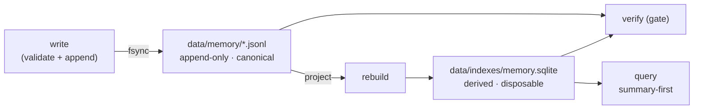

# governed-second-brain

A reference architecture for an AI memory layer that earns the word *memory*.

Most "AI second brain" setups are a folder of notes and a hopeful prompt. They
work until they don't: notes pile up faster than anything can navigate them, a
citation rule that lives in a prompt fails confidently and rarely, and a derived
view drifts from its source while everyone keeps trusting it.

This repository is the smallest faithful answer to those three failures. It is
not a product. It is a *shape* — a governed store where canonical records are
append-only, the search index is derived and disposable, and an executable
verifier decides whether the memory is intact.

It is dependency-free. A memory layer should not fall over because of a
`pip install`. The only thing it needs is a Python standard library with SQLite
FTS5, which ships by default.

## The idea in one diagram



Three properties make it a memory layer rather than a pile of files:

1. **Durable, structured artifacts** outside the context window — append-only
   JSON Lines you never rewrite.
2. **Summary-first navigation** — the full-text index covers `title`, `summary`,
   and `tags`, *never* `body`, so retrieval cost grows with the number of
   summaries, not the total volume of content.
3. **A hard verification gate** — a build-breaking check that every citation
   resolves and that the derived index matches the canonical log.

## Quickstart

```bash
# from the repository root
python -m pip install -e ".[dev]"     # or just put src/ on PYTHONPATH

governed-memory seed                  # write 5 example records to data/memory/
governed-memory rebuild               # project the log into the derived index
governed-memory verify                # the gate — prints OK or exits non-zero
governed-memory query "summary first navigation"
```

Add your own:

```bash
governed-memory write --type source \
  --title "Append-only logs as a system of record" \
  --summary "Write events once and never mutate them; derive every read view from the log." \
  --tag architecture --sensitivity public

governed-memory rebuild && governed-memory verify
```

Run the tests:

```bash
pytest -q
```

The interesting test is `test_verify_catches_dangling_citation`: it proves the
gate actually *fails* on a citation that points at a record that does not exist —
the hallucinated-citation failure made mechanical.

## The four-plane model

The repository is partitioned so that, for any concern, exactly one file is
authoritative. Read [`.github/governance-map.md`](.github/governance-map.md) to
see which.

| Plane | Root | Responsibility |
| --- | --- | --- |
| Operational | [`.github/`](.github/) | Loadable agent behaviour: instructions, skills, agent personas. |
| Contextual | [`docs/`](docs/) | Rationale and decision records. Explains; never enforces. |
| Authority | [`data/`](data/) | Canonical records, governed outputs, derived indexes. |
| Execution | [`src/`](src/) | The runnable code: validator, index builder, verifier, CLI. |

Two boundaries do the work:

- **`docs/` may explain a rule but may never *be* the rule.** Every requirement
  is enforced in `.github/`, `data/`, or `src/`. (See
  [ADR-001](docs/architecture/adr/ADR-001-four-plane-governance-boundary.md).)
- **The authority plane has sub-layers.** Source records are edited; the log is
  append-only; the index is regenerated, never patched. (See
  [ADR-002](docs/architecture/adr/ADR-002-authority-plane-sublayers-and-managed-files.md).)

## What this is honest about

- **No embeddings.** Full-text search over good summaries goes a long way. Vector
  retrieval is a real upgrade *later*, once the corpus is large enough that
  keyword matching misses paraphrases — not on day one.
- **No cloud, no MCP exfiltration.** The store is local files. Nothing here
  ships your notes anywhere. Wiring it to a remote tool is your decision and your
  risk, made explicitly.
- **Sensitivity is opt-in.** A `restricted` record refuses to be written without
  an explicit acknowledgement, so sensitive material is never captured by
  accident.
- **It is single-user and small.** That is the point. The value is the shape, not
  the scale. Grow it deliberately.

## Provenance

The framing of memory as *durable artifacts + summary-first navigation + a loop
that maintains structure* was sharpened by Roan Brasil Monteiro's essay on
reference architectures for agent memory, and by Andrej Karpathy's "LLM Wiki"
sketch. This repository is a reply in code: the minimal version that adds the one
thing those discussions agree is usually missing in practice — a verification
gate that fails the build instead of printing a warning nobody reads.

## License

[MIT](LICENSE).
