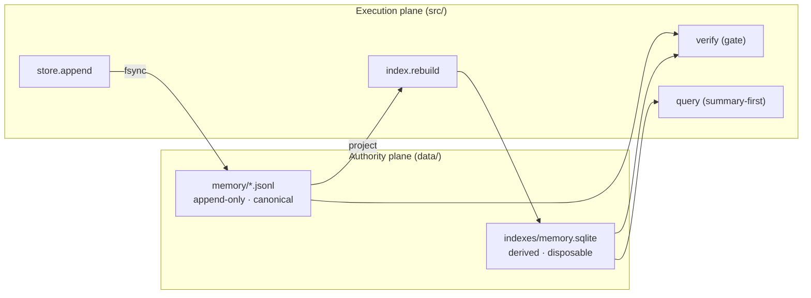

# Architecture

This reference architecture demonstrates one idea: **a memory layer earns the
word "memory" only when it separates canonical records from derived views and
keeps both honest with an executable contract.**

## The flow

1. **Write** validates a record and appends it to the JSONL log, fsynced before
   returning. The log is the system of record.
2. **Rebuild** projects the entire log into a SQLite/FTS5 index. The index is
   derived: delete it and rebuild, and you have lost nothing.
3. **Verify** is the gate. It fails the build if any citation dangles or if the
   index and the log disagree.
4. **Query** reads the index summary-first, opening a body only on demand.

## Why this shape

The promise of an "AI second brain" usually breaks in one of three places: notes
pile up faster than they can be navigated; a citation rule lives in a prompt and
fails confidently; or a derived view drifts from its source and nobody notices.
This architecture answers each with structure rather than hope — a summary-first
index, a verifier, and a strict append-only/derived split.

## Decision records

- [ADR-001 — Four-plane governance boundary](adr/ADR-001-four-plane-governance-boundary.md)
- [ADR-002 — Authority-plane sub-layers and Managed Files](adr/ADR-002-authority-plane-sublayers-and-managed-files.md)
- [ADR-003 — The governed write surface (MCP): execution-plane, default-off, local-only](adr/ADR-003-governed-write-surface.md)
- [ADR-004 — Visibility is a read-path boundary, not a label](adr/ADR-004-content-visibility-boundary.md)
- [ADR-005 — State is a separate append-only log from records](adr/ADR-005-state-event-layer.md)
- [ADR-006 — Semantic retrieval is optional, summary-only, derived, and pluggable](adr/ADR-006-semantic-retrieval.md)
- [ADR-007 — A personal-context plane: types over contents](adr/ADR-007-personal-context-plane.md)
- [ADR-008 — The operational facade is generated from canonical sources](adr/ADR-008-operational-facade-generation.md)
- [ADR-006 — Semantic retrieval is optional, summary-only, derived, and pluggable](adr/ADR-006-semantic-retrieval.md)
